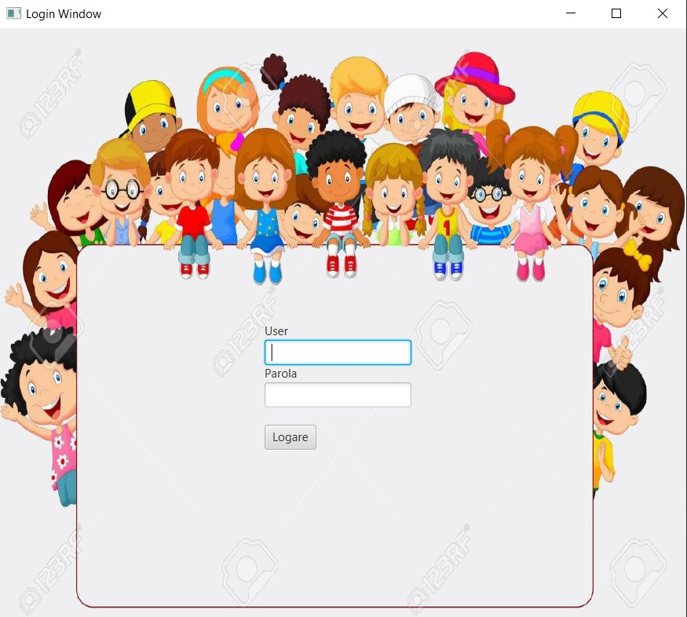
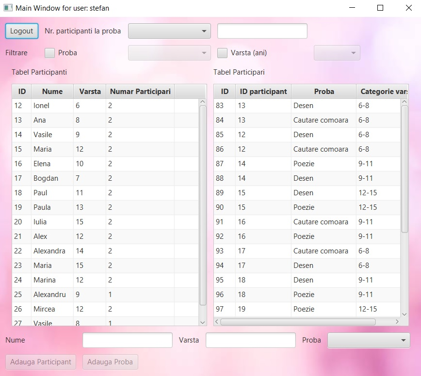

# Children Competition App

## Overview
The purpose of this application is to facilitate participant sign up at a children competition. There are three types of contests (painting, treasure hunt and poetry). Each participant can sign up to maximum two contests. The participants must be 6 to 15 years old. The authenticated organiser can see all participants and all contests they are participating at. Moreover, he can see the number of participants at each contest and can filter the participants by contest and/or age. Also, the organiser can add new participants and cand sign them up to new contests.

## Technical specifications
>**Storage**
```
The app data was stored in an SQLite database.
```
>**Frameworks**
```
This application was developed entirely in Java with the help of Spring framework,  which was used for dependency injection and remote communication between the server and the client (Spring Remoting).

```
>**Graphical user interface**
```
The graphical user interface was developed in javafx and the stylings were made in css.
```
>**Design patterns**
```
The main design patterns used in this application are:
```
```
1. Client-Server
```

```
2. Model-View-Controller
```
```
3. Observer
The server is observed by all connected clients. 
The client notifications are sent concurrently via a thread pooling mechanism:
-new participant added (every connected organiser can see the newly added entity).
-new participation added (every connected organiser can see the newly added entity; if there is an option selected from the number of participations ComboBox, the number of participations updates too and the new number glows red three times).
```

## Screenshots

### Login screen



```
The user must enter its credentials in order to log in the app.
When both username and password fields are filled, the login button activates.
If the entered credentials are invalid, an error message is displayed between the button and the password field.
```

### Main screen



```
The number of participants enrolled to each contest can be seen by selecting an option from the ComboBox right next to the "Nr. participanti la proba" label.
Participant filter by age and contest can be performed by checking the corresponding CheckBox and selecting an option from the ComboBox next to it.
The left table contains participants data, according to the applied filtering criteria (if any).
The right table contains all the participations.
A new participant can be added by pressing the "Adauga participant" button, which activates after filling the Nume and Varsta fields.
A new participation can be added by pressing the "Adauga participare" button, which activates after selecting a participant from the table and selecting a contest from the Proba ComboBox.
The user data is validated before storing it in the database.
```

## Acknowledgements
The backgroung image from the login screen was downloaded from www.123rf.com

